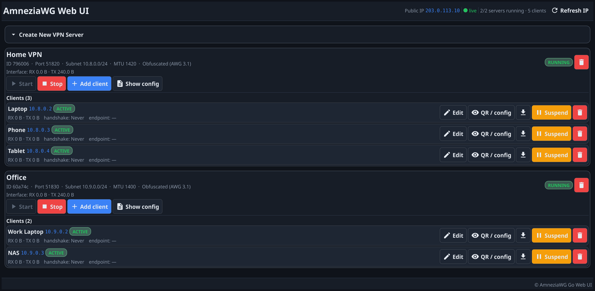
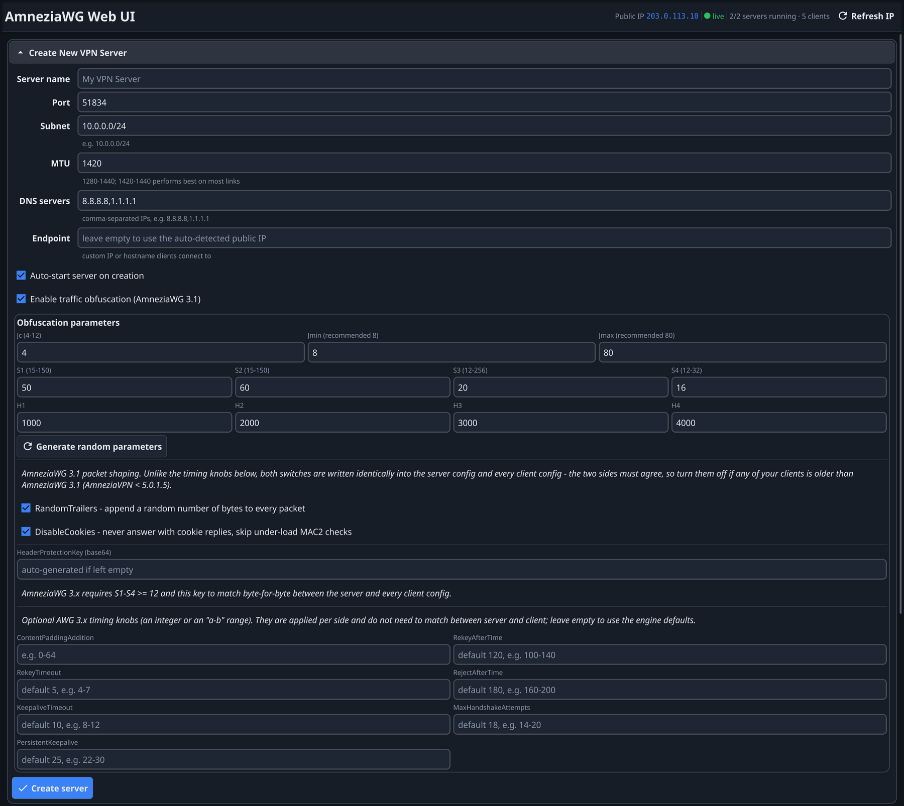

# AmneziaWG Web UI

A self-hosted web management panel for **AmneziaWG** — the obfuscated,
DPI-resistant fork of WireGuard — written as a single Go/Fiber binary. Create,
manage and monitor multiple AmneziaWG VPN servers and their clients from one
web interface, with **AmneziaWG 3.0 (header protection) as the built-in,
always-on obfuscation mode**.

All server configuration is done via the web interface or the REST API.
Environment variables at container startup mostly just provide *defaults* —
almost everything can be overridden per-request/per-server through the UI or
the API, except `WEB_UI_PORT`.




## 🔒 AmneziaWG 3.0, front and center

This is the headline feature of the project: **every server created here
uses the full AmneziaWG 3.0 parameter set** — there's no legacy 1.0/1.5/2.0
"basic obfuscation" mode to opt into or out of, it's just always on.

AmneziaWG 3.0 adds **header protection** on top of the junk-packet/padding
obfuscation that earlier AmneziaWG generations already had: the 16-byte
WireGuard packet header (message type, receiver index, counter) — the part
that was still visible in plaintext even with 1.0/1.5/2.0 obfuscation — gets
encrypted with ChaCha20 using a key (`HeaderProtectionKey`) shared between
server and client. This removes one of the last low-entropy, DPI-friendly
signatures WireGuard-based protocols leave on the wire.

What this app does for you automatically:

*   Generates a fresh, random 32-byte `HeaderProtectionKey` for every new
    server (unless you supply your own).
*   Enforces the one hard protocol requirement: `S1`-`S4` padding values must
    all be **≥ 12 bytes**, because the header-protection cipher's 12-byte
    nonce is taken from the start of that padding. The app validates this
    server-side and refuses to create a server that violates it.
*   Keeps the `HeaderProtectionKey` and all obfuscation parameters in sync
    between the server and every client config it generates for you — you
    never have to copy it around by hand.
*   Also exposes AmneziaWG 3.0's newer, optional "client-side" timing knobs
    (`ContentPaddingAddition`, `RekeyAfterTime`, `RekeyTimeout`,
    `RejectAfterTime`, `KeepaliveTimeout`, `MaxHandshakeAttempts`,
    `PersistentKeepalive`) so you can jitter handshake/keepalive timing and
    content padding, which are otherwise constant, predictable WireGuard
    timers. See [Obfuscation Parameters](#-obfuscation-parameters) below for
    the full reference, engine defaults and suggested ranges.

Docker images for this project are built straight from
[`amneziawg-go`](https://github.com/amnezia-vpn/amneziawg-go) and
[`amneziawg-tools`](https://github.com/amnezia-vpn/amneziawg-tools)'
`master` branches (not a pinned older tag), so the userspace engine and
`awg`/`awg-quick` CLI are always AmneziaWG 3.0-capable on a fresh build.

## 🚀 Features

*   **Web-based Management**: Intuitive UI for managing VPN servers and clients
*   **AmneziaWG 3.0 by default**: header protection, junk packets, message padding and header obfuscation are always fully configured — see above
*   **Client Management**: Generate and download client configurations. Suspend and reactivate clients on a live server.
*   **Real-time Monitoring**: Live server status, traffic and connection monitoring over Socket.IO
*   **Auto-start**: Automatic server startup on container restart
*   **IPTables Automation**: Automatic firewall configuration
*   **Custom values**: MTU, subnet, port, DNS and every AmneziaWG 3.0 obfuscation parameter can be customized per server
*   **QR code**: Client configs can be viewed, copied and downloaded as text, `.conf` file or QR code
*   **Config view**: Both servers' and clients' configs can be viewed directly from the UI
*   **Client data**: Clients' traffic, last handshake and endpoint IP are displayed and auto-refreshed

## 🏗️ Architecture

### Components

**Go/Fiber Backend** (`main.go`, `internal/`)

*   `main.go` — wires up the Fiber app, embeds the frontend, sets up basic auth and Socket.IO, and starts listening on `WEB_UI_PORT`
*   `internal/handlers.go` — REST API route handlers
*   `internal/manager.go` — business logic: server/client lifecycle, AmneziaWG config file generation (including all AmneziaWG 3.0 parameters), iptables, key generation
*   `internal/types.go` — data models (`Server`, `Client`, `ObfuscationParams`, request/response payloads)
*   `internal/ws.go` — Socket.IO hub, periodic traffic broadcasts
*   No reverse proxy, no supervisor: the single compiled binary (`/usr/bin/api` in the container) does everything, with [`tini`](https://github.com/krallin/tini) as PID 1 just to reap orphaned child processes

**Frontend** (`web-ui/templates/index.html`, `web-ui/static/js/app.js`)

*   Plain HTML + vanilla JavaScript, no build step or framework — embedded into the Go binary at compile time via `go:embed`
*   Responsive web interface with Tailwind utility classes
*   Real-time status updates over Socket.IO
*   Client-side form validation mirroring the backend's AmneziaWG 3.0 parameter rules (S1-S4 ≥ 12, Jmin/Jmax bounds, etc.)

### Directory Structure

```
.
├── main.go                    # Entry point, Fiber app, embeds web-ui/
├── internal/
│   ├── handlers.go            # REST API route handlers
│   ├── manager.go             # Server/client lifecycle & AmneziaWG config generation
│   ├── types.go               # Data models
│   └── ws.go                  # Socket.IO hub
├── web-ui/
│   ├── templates/
│   │   └── index.html         # Main web interface (embedded)
│   └── static/
│       ├── js/
│       │   └── app.js         # Frontend JavaScript (embedded)
│       └── css/
│           └── style.css      # Custom styles (embedded)
├── scripts/
│   ├── start.sh                # Container entrypoint (exec'd by tini)
│   ├── setup_iptables.sh
│   └── cleanup_iptables.sh
├── Dockerfile                  # Multi-stage build: Go binary + amneziawg-go + amneziawg-tools
├── docker-compose.yml           # Base compose file (runs a pre-built image, no build)
├── docker-compose.build.yml      # Overlay adding `build: .` (used by `make run`)
└── Makefile
```

## 🔨 Building & Running Locally

Requires Go 1.26+.

```bash
make build   # go build -o server.bin . — compiles the binary, no docker
make vet     # go vet ./... — lint check
make run     # docker compose -f docker-compose.yml -f docker-compose.build.yml up --build
             # builds the full image from source (Go binary + amneziawg-go + amneziawg-tools) and runs it
```

`make run` is the easiest way to get a fully working container (with a
real, v3-capable AmneziaWG userspace engine) without installing anything
besides Docker. Configuration defaults for a local run live in `.env`
(`WEB_UI_PORT`, `DEFAULT_PORT`, `AUTO_START_SERVERS`, `DEFAULT_MTU`,
`WEB_UI_PASSWORD`, ...).

## 🔧 API Endpoints

### Server Management

#### Create Server

```yaml
POST /api/servers
Content-Type: application/json

{
  "name": "My VPN Server",
  "port": 51834,
  "subnet": "10.0.0.0/24",
  "mtu": 1280,
  "obfuscation": true,
  "auto_start": true,
  "obfuscation_params": {
    "Jc": 8,
    "Jmin": 8,
    "Jmax": 80,
    "S1": 50,
    "S2": 60,
    "S3": 20,
    "S4": 16,
    "H1": 1000,
    "H2": 2000,
    "H3": 3000,
    "H4": 4000,
    "MTU": 1280
  }
}
```

#### AmneziaWG 3.0 (header protection)

There is only one obfuscation mode now: setting `"obfuscation": true` always
enables the full AmneziaWG 3.0 parameter set, including mandatory header
protection. Older 1.0/1.5/2.0-only modes (and the previous `awg2`/`awg3`
request flags) have been removed.

*   `S1`, `S2`, `S3`, `S4` must all be **≥ 12** (the header-protection cipher
    takes its 12-byte nonce from the start of this padding); the server
    rejects the request otherwise.
*   A 32-byte base64 `HeaderProtectionKey` is required and generated
    automatically if you don't supply one in `obfuscation_params`. It must be
    identical, byte-for-byte, between the server and every one of its
    clients — the app takes care of that automatically for configs it
    generates.
*   Optional "client-side" tuning knobs (each side applies them to its own
    behavior, so they don't need to match between server and client):
    `ContentPaddingAddition`, `RekeyAfterTime`, `RekeyTimeout`,
    `RejectAfterTime`, `KeepaliveTimeout`, `MaxHandshakeAttempts`,
    `PersistentKeepalive`. All accept a plain integer or an `"a-b"` range
    (e.g. `"5-10"`); leave them unset to use the engine defaults.

    | Parameter | Engine default (unset) | Suggested range |
    |---|---|---|
    | `ContentPaddingAddition` | off (16-byte alignment) | `0-64` |
    | `RekeyAfterTime` | 120s | `100-140` |
    | `RekeyTimeout` | 5s | `4-7` |
    | `RejectAfterTime` | 180s | `160-200` |
    | `KeepaliveTimeout` | 10s | `8-12` |
    | `MaxHandshakeAttempts` | 18 | `14-20` |
    | `PersistentKeepalive` | 25s | `22-30` (from `amneziawg-go`'s own README example) |

    The "engine default" column comes straight from
    `amneziawg-go`'s `device/constants.go` (standard WireGuard timing
    constants). Only `Jc` (`4-12`) and `PersistentKeepalive` (`22-30`) have an
    officially documented recommended range — the rest of the "suggested
    range" column is a conservative jitter around the defaults, not an
    official recommendation, since AmneziaWG doesn't publish one.

```yaml
POST /api/servers
Content-Type: application/json

{
  "name": "My VPN Server (AWG 3.0)",
  "port": 51834,
  "subnet": "10.0.1.0/24",
  "mtu": 1280,
  "obfuscation": true,
  "obfuscation_params": {
    "Jc": 8, "Jmin": 8, "Jmax": 80,
    "S1": 50, "S2": 66, "S3": 20, "S4": 16,
    "H1": 1000, "H2": 2000, "H3": 3000, "H4": 4000,
    "MTU": 1280,
    "ContentPaddingAddition": "0-64",
    "RekeyAfterTime": "100-140",
    "PersistentKeepalive": "22-30"
  }
}
```

> [!NOTE]
> **Migrating an already-running server**: existing servers keep working
> unchanged — this change only affects newly created servers. The Docker
> image already builds `amneziawg-go`/`amneziawg-tools` from their `master`
> branches, so a fresh `docker compose build`/`make run` picks up 3.0-capable
> binaries automatically; no image changes are needed. Servers created
> before this change (without a `HeaderProtectionKey`, and possibly with
> `S1`-`S4` below 12) keep running exactly as before — nothing rewrites
> their config files automatically. To move such a server to AmneziaWG 3.0
> you must recreate it (or hand-edit `web_config.json` and the server's
> `.conf` file to add `S1`-`S4` ≥ 12 and a `HeaderProtectionKey`), then
> redistribute regenerated client configs — old client configs without the
> matching `HeaderProtectionKey` will not be able to connect once the server
> has header protection turned on.

#### List Servers

`GET /api/servers`

#### Start Server

`POST /api/servers/{server_id}/start`

#### Stop Server

`POST /api/servers/{server_id}/stop`

#### Delete Server

`DELETE /api/servers/{server_id}`

#### Get Server Configuration

`GET /api/servers/{server_id}/config`

#### Download Server Config

`GET /api/servers/{server_id}/config/download`

#### Get Server Info

`GET /api/servers/{server_id}/info`

#### Get Server Traffic

`GET /api/servers/{server_id}/traffic`

#### Get Traffic For All Servers

`GET /api/servers/traffic`

### Client Management

#### Add Client

```yaml
POST /api/servers/{server_id}/clients
Content-Type: application/json
{
  "name": "Alice's Phone",
  "apply_i_settings": false,
  "i_settings": {},
  "allowed_ips": "0.0.0.0/0, ::/0"
}
```

#### List Server Clients

`GET /api/servers/{server_id}/clients`

#### List All Clients (across all servers)

`GET /api/clients`

#### Delete Client

`DELETE /api/servers/{server_id}/clients/{client_id}`

#### Update Client AllowedIPs

`PUT /api/servers/{server_id}/clients/{client_id}/allowed-ips`

#### Update Client I-Settings (I1-I5 signature packets)

`PUT /api/servers/{server_id}/clients/{client_id}/i-settings`

#### Suspend / Activate a Client (drop the peer live without deleting it)

`POST /api/servers/{server_id}/clients/{client_id}/suspend`
`POST /api/servers/{server_id}/clients/{client_id}/activate`

#### Set Client Auto-Suspend Time

`PUT /api/servers/{server_id}/clients/{client_id}/suspend-time`

#### Download Client Config as `text/plain` (.conf file)

`GET /api/servers/{server_id}/clients/{client_id}/config`

#### Get Client Config in Both Text and QR/JSON Form

`GET /api/servers/{server_id}/clients/{client_id}/config-both`

#### Get Default I-Settings (I1-I5 defaults used when `apply_i_settings` is on)

`GET /api/default-i-settings`

### System Management

#### System Status (public IP, etc.)

`GET /api/system/status`

#### Refresh Public IP

`GET /api/system/refresh-ip`

#### IPTables Test

`GET /api/system/iptables-test?server_id=wg_abc123`

## 🐳 Docker Deployment

CI builds and pushes the image to Docker Hub on every push to `master`/tags
(see `.github/workflows/docker.yaml`); check your own fork's Docker Hub
repository (`docker.io/<your-dockerhub-username>/<repo-name>`) for the exact
tag, or just build locally with `make run` / `docker compose build`.

### Environment Variables

| Variable | Default | Description |
|----------|---------|-------------|
| `WEB_UI_PORT` | `80` | Port the app listens on for the web interface |
| `WEB_UI_USER` | `admin` | Username for basic auth in the app |
| `WEB_UI_PASSWORD` | `changeme` | Password for basic auth in the app  SHA-256 `printf 'secret' \| openssl dgst -binary -sha256 \| base64` |
| `AUTO_START_SERVERS` | `true` | Auto-start servers on container startup |
| `DEFAULT_MTU` | `1280` | Default MTU value for new servers. Effective only for api requests. For UI management set via UI. |
| `DEFAULT_SUBNET` | `10.0.0.0/24` | Default subnet for new servers. Effective only for api requests. For UI management set via UI. |
| `DEFAULT_PORT` | `51834` | Default port for new servers. Effective only for api requests. For UI management set via UI. |
| `DEFAULT_DNS` | `8.8.8.8,1.1.1.1` | Default DNS servers for clients. Effective only for api requests. For UI management set via UI. |

### Docker Compose Example

This repo already ships two compose files: `docker-compose.yml` (base, runs a
pre-built `image:`, no build step) and `docker-compose.build.yml` (an overlay
that adds `build: .`). `make run` combines both to build from source and run;
`make run-image` runs the base file only, against an already-built/pulled
image. A minimal standalone example, building locally:

```yaml
services:
  app:
    build: .
    restart: unless-stopped
    ports:
      - "8080:8080/tcp"
      - "51834:51834/udp"
    environment:
      - WEB_UI_PORT=8080
      - AUTO_START_SERVERS=true
      - DEFAULT_MTU=1280
    volumes:
      - amnezia-data:/etc/amnezia
    cap_add:
      - NET_ADMIN
      - SYS_MODULE
    devices:
      - /dev/net/tun
    sysctls:
      - net.ipv4.ip_forward=1
      - net.ipv4.conf.all.src_valid_mark=1
      - net.ipv6.conf.all.disable_ipv6=0
      - net.ipv6.conf.all.forwarding=1
      - net.ipv6.conf.default.forwarding=1
volumes:
  amnezia-data:
```

### Docker Run Example

```bash
docker run -d \
  --name amnezia-web-ui \
  --cap-add=NET_ADMIN \
  --cap-add SYS_MODULE \
  --sysctl net.ipv4.ip_forward=1 \
  --sysctl net.ipv4.conf.all.src_valid_mark=1 \
  --device /dev/net/tun \
  --restart unless-stopped \
  -p 9090:9090 \
  -p 51821:51821/udp \
  -e WEB_UI_PORT=9090 \
  -e WEB_UI_PASSWORD=1234 \
  -e AUTO_START_SERVERS=false \
  -e DEFAULT_MTU=1420 \
  -e DEFAULT_SUBNET=10.8.0.0/24 \
  -e DEFAULT_PORT=51821 \
  -e DEFAULT_DNS="8.8.8.8,8.8.4.4" \
  -v amnezia-data:/etc/amnezia \
  <your-image>:latest
```

If you need HTTPS, put your own TLS-terminating reverse proxy (nginx, Caddy, Traefik, etc.) in front of the container and forward to `WEB_UI_PORT`.

## 📊 Obfuscation Parameters

Every server created here uses the full AmneziaWG 3.0 obfuscation parameter
set (see [AmneziaWG 3.0, front and center](#-amneziawg-30-front-and-center)
above for the header-protection-specific parameters, engine defaults and
suggested ranges of the optional timing knobs). This section covers the
base junk-packet/padding/header parameters shared with earlier AmneziaWG
generations.

### Parameter Reference

| Parameter | Constraint | Example default | Description |
| --- | --- | --- | --- |
| `Jc` | 4-12 recommended | 8 | Number of junk packets sent before the handshake |
| `Jmin` | ≥ 1, < `Jmax` | 8 | Minimum size of each junk packet |
| `Jmax` | > `Jmin`, ≤ MTU | 80 | Maximum size of each junk packet |
| `S1` | 15-150, ≤ MTU-148 | 50 | Padding before the handshake-initiation message |
| `S2` | 15-150, ≤ MTU-92, `S1+56 ≠ S2` | 60 | Padding before the handshake-response message |
| `S3` | **≥ 12** (header protection), ≤ 256 | 20 | Padding before the cookie-reply message |
| `S4` | **≥ 12** (header protection), ≤ 32 | 16 | Padding before every transport (data) message |
| `H1`-`H4` | Unique, 5 to 2147483647 | 1000/2000/3000/4000 | Message-type header values for handshake-init/response/cookie/transport |
| `HeaderProtectionKey` | 32-byte base64 | auto-generated | AmneziaWG 3.0 header-protection key, must match on server and client |
| `MTU` | 1280-1440 | 1280 | Maximum Transmission Unit for the tunnel interface |

`S1`/`S2` bounds scale with MTU (`S1 ≤ MTU-148`, `S2 ≤ MTU-92`, both capped
at 150); the app enforces this and the `S1+56 ≠ S2` and `S3`/`S4` ≥ 12 rules
both client-side (JS validation) and server-side before writing any config
file.

### Detailed Parameter Explanation

#### Jc, Jmin, Jmax (junk packets)

*   Sent right before every handshake attempt to break the fixed
    two-datagram WireGuard handshake signature.
*   Lower `Jc` = fewer junk packets (better performance, less obfuscation);
    higher `Jc` = more junk packets (more obfuscation, slightly more
    overhead). 4-12 is the generally recommended range.

#### S1-S4 (message padding)

*   `S1`/`S2` pad the handshake-initiation/response messages; `S3`/`S4` pad
    the cookie-reply/transport messages.
*   Since AmneziaWG 3.0's header protection takes its 12-byte cipher nonce
    from the start of this padding, **all four must be ≥ 12** whenever
    `HeaderProtectionKey` is set (which this app always sets).

#### H1-H4 (header values)

*   Replace the message-type field of each packet type so it doesn't look
    like a recognizable WireGuard/AmneziaWG signature. All four must be
    unique from each other.

#### MTU

*   `1280` is the safest, most compatible value; `1420`-`1440` gives better
    throughput but can hit fragmentation issues on some networks.

## 📝 Logs and Monitoring

### Application logs

The app logs only to stdout/stderr (standard practice for containers), view them with:

`docker logs -f amnezia-web-ui`

## 🔄 Backup and Restore

There's no dedicated export/import API endpoint — back up the whole
AmneziaWG state directory, which contains every server's `web_config.json`
(server/client metadata, keys, all AmneziaWG 3.0 parameters) and each
interface's `.conf` file:

```bash
docker cp amnezia-web-ui:/etc/amnezia ./amnezia-backup/
```

To restore, stop the container, copy the backed-up directory back onto the
`/etc/amnezia` volume, and start the container again.

For a single server/client, you can also just download its config via the
UI or `GET /api/servers/{server_id}/config` /
`GET /api/servers/{server_id}/clients/{client_id}/config`.

## Debug Commands

### Check server status

`curl http://localhost/api/system/status`

### Test iptables configuration

`curl "http://localhost/api/system/iptables-test?server_id=wg_abc123"`

# Security
The app is exposed directly on port 80 (or a custom `WEB_UI_PORT`) with basic authentication built into the Fiber app itself.

> [!IMPORTANT]
> I strongly recommend protecting endpoints with a firewall and/or a TLS-terminating reverse proxy in front of the container.
> Basic auth alone is not strong enough and can be bruteforced.

By default, docker image is built with user `admin` and password `changeme`. To change the default behavior you need to provide with docker envs `WEB_UI_USER` and `WEB_UI_PASSWORD`.

# Support
The NO support provided as well as no regular updates are planned. Found issues can be fixed if free time permits.

From Russia with L❤️VE